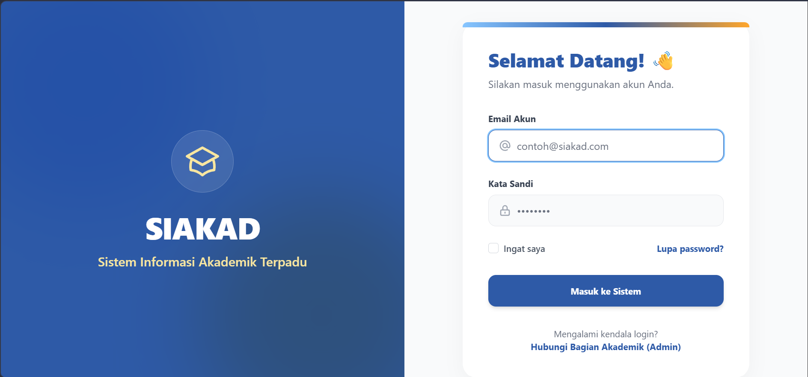
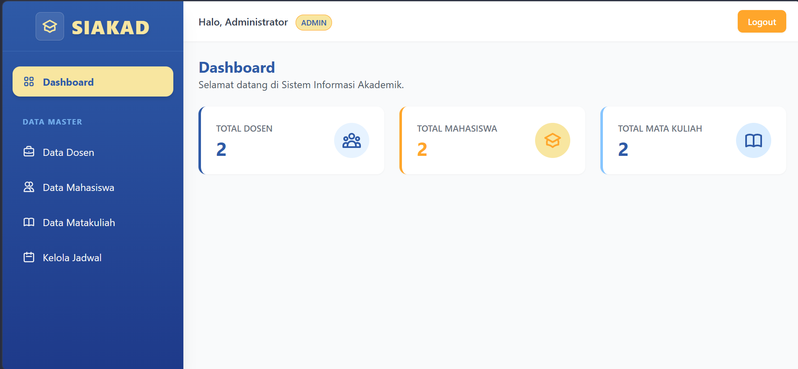
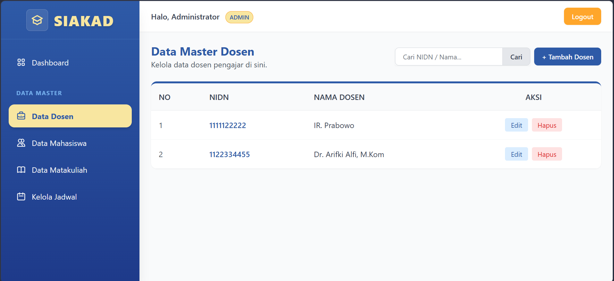
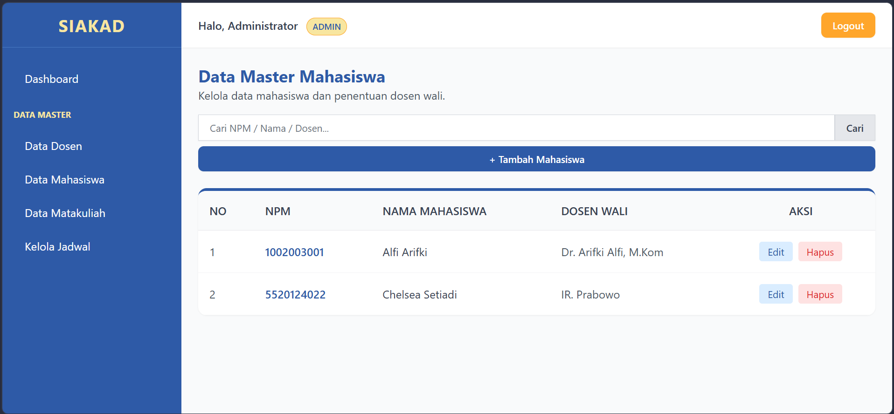
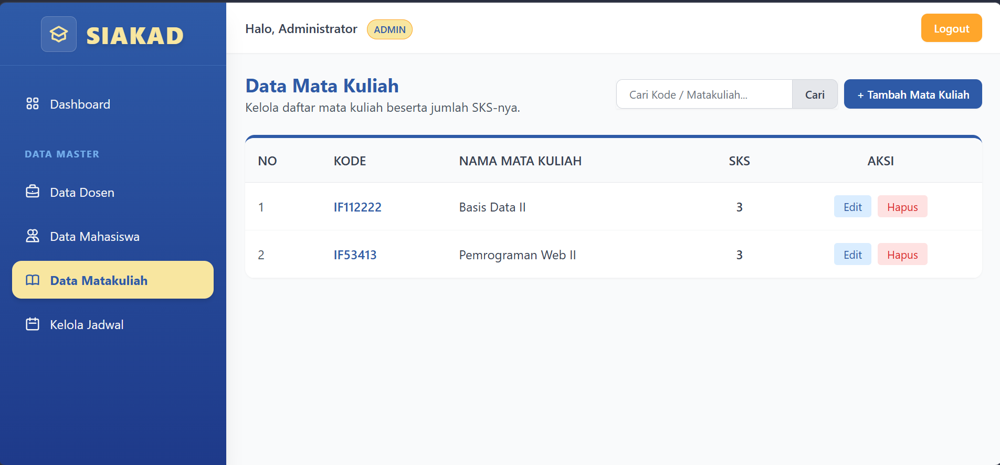
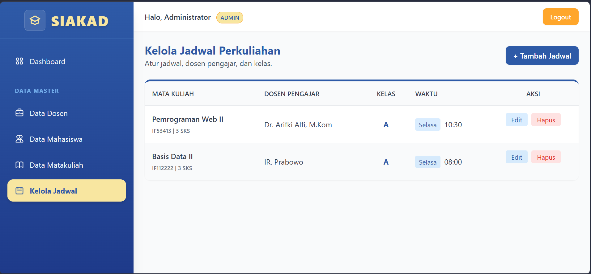
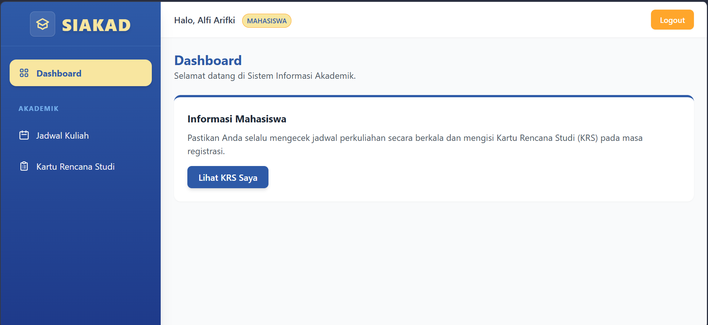
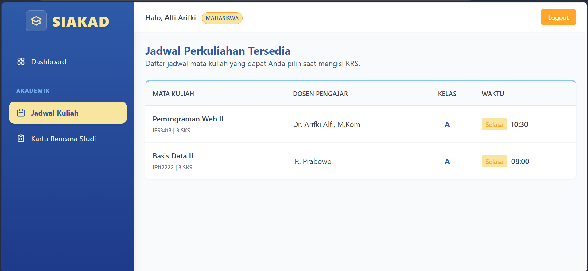
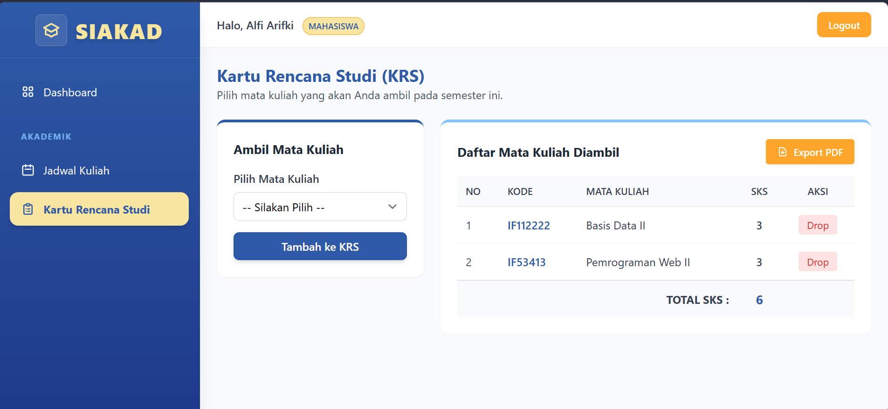

# SIAKAD Sederhana - Tugas Besar Mata Kuliah Web II 🎓

Sistem Informasi Akademik (SIAKAD) Sederhana ini adalah aplikasi berbasis web yang dikembangkan menggunakan framework **Laravel**. Aplikasi ini dibuat untuk memenuhi Tugas Besar Mata Kuliah Web II (IF53413), mensimulasikan manajemen data akademik dasar meliputi pengelolaan data Dosen, Mahasiswa, Mata Kuliah, Jadwal Perkuliahan, hingga pengisian Kartu Rencana Studi (KRS).

Aplikasi ini didesain dengan antarmuka yang modern, responsif, dan elegan menggunakan **Tailwind CSS** dengan palet warna khusus.

---

## 👥 Hak Akses (Role)

Sistem ini memiliki 2 jenis pengguna dengan hak akses yang diatur menggunakan *Middleware*:

1. **Admin**
   * Memiliki akses penuh untuk mengelola (CRUD) seluruh Data Master.
   * Menentukan dosen wali bagi mahasiswa.
   * Mengatur jadwal perkuliahan secara menyeluruh.
2. **Mahasiswa**
   * Hanya dapat melihat daftar jadwal perkuliahan yang tersedia.
   * Mengambil mata kuliah (Input KRS) dan melakukan *drop* mata kuliah.
   * Mencetak KRS ke dalam format PDF.

---

## ✨ Fitur Utama

* **Autentikasi Aman:** Sistem Login dan Logout menggunakan Laravel Auth dengan desain halaman *split-screen* yang modern.
* **Dashboard Interaktif:** Menampilkan ringkasan statistik jumlah Dosen, Mahasiswa, dan Mata Kuliah secara *real-time*.
* **Manajemen Data Master (CRUD) & Pencarian:**
    * **Data Dosen:** Tambah, edit, hapus, dan cari berdasarkan NIDN atau Nama.
    * **Data Mahasiswa:** Tambah, edit, hapus, dan cari berdasarkan NPM, Nama, atau Dosen Wali. (Akun login mahasiswa dibuat secara otomatis saat data ditambahkan).
    * **Data Mata Kuliah:** Tambah, edit, hapus, dan cari berdasarkan Kode atau Nama Mata Kuliah.
* **Manajemen Jadwal Perkuliahan:** Admin merelasikan Mata Kuliah, Dosen Pengajar, Hari, Jam, dan Kelas.
* **Kartu Rencana Studi (KRS):** Mahasiswa dapat memilih mata kuliah yang ditawarkan sesuai dengan jadwal yang ada.
* **Cetak PDF (Fitur Bonus):** Mahasiswa dapat mengekspor dan mengunduh daftar KRS mereka dalam bentuk dokumen PDF yang rapi (menggunakan *dompdf*).

---

## 🛠️ Teknologi yang Digunakan

* **Backend:** Laravel 11 (PHP)
* **Frontend:** Tailwind CSS (Blade Templating)
* **Database:** MySQL (Eloquent ORM, Migrations, Seeders)
* **Library Tambahan:** `barryvdh/laravel-dompdf` (Untuk *export* PDF)

---

## 👥 Akun dan link hosting (Role)

Admin
email : admin@siakad.com 
password : password

Mahasiswa
email : alfi@siakad.com
password : password

Link 
http://alfiarifki.infinityfreeapp.com/login

## 📸 Dokumentasi Antarmuka (Screenshots)

Berikut adalah tampilan antarmuka dari aplikasi SIAKAD Sederhana:

### 1. Halaman Login

### 2. Dashboard Admin

### 3. Manajemen Data Master Dosen

### 4. Manajemen Data Mahasiswa

### 5. Manajemen Mata Kuliah

### 6. Manajemen Jadwal Perkuliahan

### 7. Halaman Dashboard Mahasiswa

### 8. halaman Jadwal Perkuliahan Mahasiswa

### 9. Halaman KRS Mahasiswa & Fitur Export PDF

*(Alfi Arifki - IF A 2024 - 5520124022)*

---

